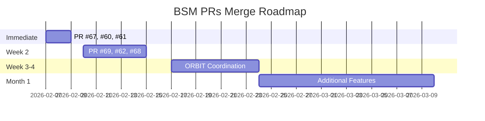

# ✅ قائمة مراجعة دمج طلبات السحب - BSM

**التاريخ:** 2026-02-07  
**المستودع:** LexBANK/BSM  
**إجمالي PRs:** 30

---

## 📋 الجدول الرئيسي - الأولويات

### 🟢 المرحلة 1: دمج فوري (هذا الأسبوع)

| # | PR | العنوان | التغييرات | الحالة | الإجراء |
|---|----|---------|-----------|---------|---------| 
| 1 | #67 | Core completion handoff guide | +88/-0 | ✅ جاهز | `git merge` |
| 2 | #60 | Knowledge index API | +188/-16 | ✅ جاهز | `git merge` |
| 3 | #61 | Core CI workflows | +193/-526 | ✅ جاهز | `git merge` |

**الأمر:**
```bash
gh pr merge 67 --repo LexBANK/BSM --squash
gh pr merge 60 --repo LexBANK/BSM --squash
gh pr merge 61 --repo LexBANK/BSM --squash
```

---

### 🟡 المرحلة 2: مراجعة ودمج (الأسبوع القادم)

| # | PR | العنوان | التغييرات | المطلوب | الوقت |
|---|----|---------|-----------|---------|---------| 
| 4 | #69 | Performance 865x faster | +808/-30 | مراجعة كود | 2-3 أيام |
| 5 | #62 | Cloudflare CI/CD | +223/-0 | اختبار workflows | 1-2 يوم |
| 6 | #68 | ORBIT workers | +441/-0 | حل 8 comments | 2-3 أيام |

**الخطوات:**
```bash
# PR #69
gh pr view 69 --repo LexBANK/BSM
gh pr checkout 69
npm test
npm run lint
# Review caching code → Approve → Merge

# PR #62
gh pr checkout 62
# Test Cloudflare workflows
# Approve → Merge

# PR #68
gh pr view 68 --repo LexBANK/BSM --comments
# Address review comments
# Approve → Merge
```

---

### 🟠 المرحلة 3: تنسيق وحل التداخل (أسبوعين)

#### ⚠️ ORBIT PRs - تداخل محتمل

| PR | العنوان | الحجم | الحالة | الأولوية |
|----|---------|--------|---------|----------| 
| #70 | ORBIT bootstrap automation | +1978 | Open | ⭐⭐⭐ |
| #66 | ORBIT Agent + Telegram | +2297 | Open | ⭐⭐⭐ |
| #64 | Self-healing worker | +200 | Open | ⭐⭐ |
| #63 | Hybrid Agent TypeScript | +2345 | Open | ⭐⭐ |
| #68 | ORBIT workers (أعلاه) | +441 | Open | ⭐⭐⭐⭐ |

**قرار مطلوب:**
```
اختيار PR رئيسي واحد من:
  Option A: PR #68 (الأحدث، متوازن)
  Option B: PR #70 (الأكبر، شامل)
  
الخطوات:
1. اختيار PR رئيسي
2. مقارنة الميزات بين جميع الـ PRs
3. دمج الميزات الفريدة في PR الرئيسي
4. إغلاق البقية مع شرح
```

---

### 🔵 المرحلة 4: ميزات إضافية (3-4 أسابيع)

#### الميزات الجديدة

| PR | العنوان | الحجم | النوع | الأولوية |
|----|---------|-------|-------|----------| 
| #71 | Schedule tracker | +1935 | Feature | ⭐⭐⭐ |
| #72 | Cloudflare testing | +1512 | Testing | ⭐⭐ |
| #59 | Full-stack chat app | +5364 | Feature | ⭐⭐⭐ |
| #57 | Go language support | +627 | Feature | ⭐⭐ |

#### التوثيق والتحليل

| PR | العنوان | النوع | الأولوية |
|----|---------|-------|----------| 
| #77 | CLAUDE.md docs | Documentation | ⭐⭐ |
| #75 | Performance bottlenecks | Analysis | ⭐⭐ |
| #76 | PR analysis tool | Tool | ⭐ |
| #58 | Security audit | Documentation | ⭐⭐⭐ |

#### الأدوات والتكامل

| PR | العنوان | النوع | الأولوية |
|----|---------|-------|----------| 
| #79 | Windows bootstrap | Script | ⭐ |
| #74 | Claude Assistant | Integration | ⭐⭐ |
| #73 | GitHub Models API | Integration | ⭐⭐ |
| #65 | PR validation system | Tool | ⭐⭐ |

#### المعمارية الكبيرة

| PR | العنوان | الحجم | النوع |
|----|---------|-------|-------| 
| #55 | Hybrid Node.js/Go | كبير | Architecture |
| #54 | Knowledge base generator | متوسط | Feature |
| #53 | AgentOS core workflow | كبير | Architecture |
| #52 | Agent Engine + security | كبير | Architecture |
| #51 | Azure deployment | صغير | CI/CD |

---

## 📊 الإحصائيات التفصيلية

### حسب الحالة
```
✅ جاهز للدمج:         5 PRs (17%)
🟡 يحتاج مراجعة:      13 PRs (43%)
🔴 مسودة/WIP:          12 PRs (40%)
⚠️ تعارضات:            0 PRs (0%)
```

### حسب الحجم
```
📄 صغير (<100):        6 PRs
📑 متوسط (100-500):    8 PRs
📚 كبير (500-1000):    5 PRs
📦 ضخم (>1000):       11 PRs
```

### حسب النوع
```
🏗️ Infrastructure:     8 PRs
🤖 ORBIT:              7 PRs
⚡ Performance:        3 PRs
📚 Documentation:      3 PRs
✨ Features:           5 PRs
🔒 Security:           2 PRs
🧪 Testing:            2 PRs
```

---

## 🎯 خارطة الطريق



---

## ✅ قائمة المراجعة - Checklist

### الأسبوع 1 (2026-02-07 → 2026-02-14)
- [ ] دمج PR #67 (Documentation)
- [ ] دمج PR #60 (Knowledge Base)
- [ ] دمج PR #61 (CI workflows)
- [ ] اختبار النظام بعد الدمج
- [ ] تحديث التوثيق

### الأسبوع 2 (2026-02-14 → 2026-02-21)
- [ ] مراجعة PR #69 (Performance)
  - [ ] مراجعة كود الـ caching
  - [ ] اختبار الأداء
  - [ ] قياس التحسينات
- [ ] اختبار PR #62 (Cloudflare)
  - [ ] اختبار workflows
  - [ ] التحقق من النشر
- [ ] حل PR #68 comments
  - [ ] معالجة الـ 8 تعليقات
  - [ ] مراجعة نهائية

### الأسابيع 3-4 (2026-02-21 → 2026-03-07)
- [ ] تنسيق ORBIT PRs
  - [ ] اختيار PR رئيسي
  - [ ] مقارنة الميزات
  - [ ] دمج الميزات الفريدة
  - [ ] إغلاق المكررات
- [ ] مراجعة الميزات الإضافية
  - [ ] PR #71 (Schedule tracker)
  - [ ] PR #72 (Cloudflare testing)
  - [ ] PR #59 (Chat app)
  - [ ] PR #57 (Go support)

### الشهر الأول (2026-02-07 → 2026-03-07)
- [ ] دمج جميع PRs الأساسية
- [ ] حل جميع التعارضات
- [ ] تحديث CI/CD للاستقرار
- [ ] مراجعة نهائية شاملة
- [ ] إنشاء سياسة PR management

---

## 🚨 المخاطر والتحديات

### 1. تداخل ORBIT PRs
**الخطر:** 5 PRs متشابهة قد تتعارض  
**الحل:** تنسيق واختيار PR واحد رئيسي  
**الأولوية:** 🔴 عالية

### 2. CI/CD غير مستقر
**الخطر:** 28 PR في حالة unstable  
**الحل:** Rebase على main + اختبار  
**الأولوية:** 🟡 متوسطة

### 3. PRs كبيرة جداً
**الخطر:** صعوبة المراجعة والاختبار  
**الحل:** تقسيم إلى PRs أصغر  
**الأولوية:** 🟡 متوسطة

### 4. عدد كبير من PRs
**الخطر:** صعوبة الإدارة والتتبع  
**الحل:** دمج بالأولوية + إغلاق القديمة  
**الأولوية:** 🟢 منخفضة

---

## 📞 الملفات والمراجع

### التقارير المُنشأة
- `reports/QUICK-PR-REVIEW.md` - مراجعة سريعة
- `reports/pr-orchestrator-review-20260207.md` - تقرير كامل
- `reports/pr-analysis-summary.json` - بيانات JSON
- `reports/README.md` - دليل الاستخدام
- `PR-REVIEW-FINAL-REPORT.md` - تقرير نهائي

### السكربتات
- `scripts/merge-approved-prs.sh` - دمج تلقائي

### الأوامر المفيدة
```bash
# عرض جميع PRs
gh pr list --repo LexBANK/BSM

# عرض PR معين
gh pr view <number> --repo LexBANK/BSM

# دمج PR
gh pr merge <number> --repo LexBANK/BSM --squash

# عرض التعارضات
gh pr view <number> --repo LexBANK/BSM --json mergeable

# عرض التعليقات
gh pr view <number> --repo LexBANK/BSM --comments
```

---

## 🎉 الخاتمة

تم إنشاء هذه القائمة لتسهيل عملية المراجعة والدمج. استخدمها كدليل لتتبع التقدم.

**الخطوة التالية:** ابدأ بدمج الـ 3 PRs الجاهزة (#67, #60, #61)

---

**آخر تحديث:** 2026-02-07  
**الإصدار:** 1.0  
**الحالة:** ✅ جاهز للاستخدام
